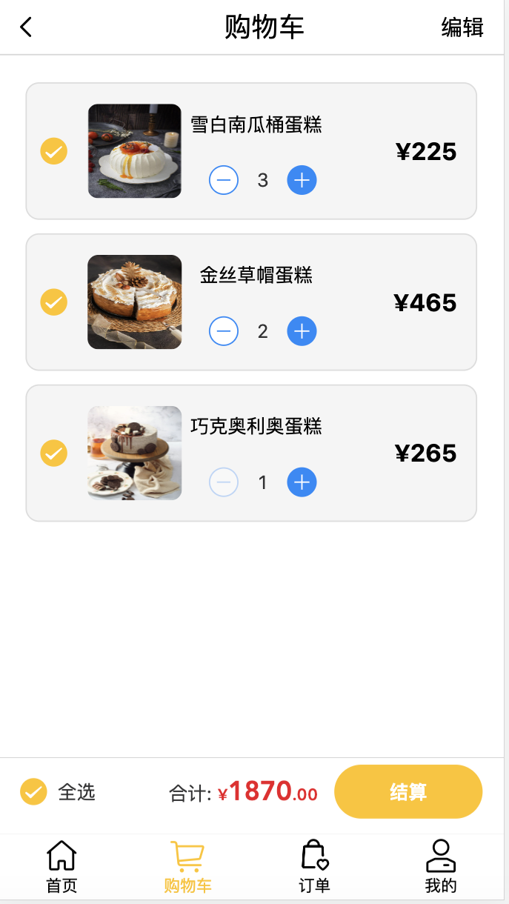
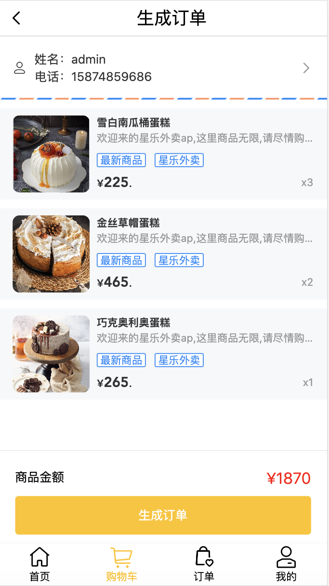

# 基于Vue3开发的（星乐外卖）外卖项目（移动端）
------------------------

 

## 前言
该项目为前后端分离项目的前端部分（前端的前台项目）。

## 项目介绍
星乐外卖项目为了使客户购买商品或食品更加方便而开发了该项目，此项目分为登陆/注册功能，商品选择功能，生成订单功能，添加/修改收货地址功能，加入购物车功能，生成订单功能，结算/模拟支付等功能。
## 项目演示（已停用）
项目在线演示地址：https://jxlscript.gitee.io/vue-admin-jxl/
## 技术栈
html(5) + css(3) + Javascrip + Vue + vuex + vue-router + vue-cli + ES6/7/8 + axios + VantUI + node + less + 阿里图标 + mock 
## 说明
>  本项目主要用于熟悉如何用 vue3 架构一个外卖app项目

>  如果对您有帮助，您可以点右上角 "Star" 支持一下 谢谢！ ^_^

>  或者您可以 "follow" 一下，我会不断开源更多的有趣的项目

>  开发环境 MacBook Pro  Chrome 

>  如有问题请直接在 Issues 中提，或者您发现问题并有非常好的解决方案，欢迎 PR 👍

>当你学到这里的时候，恭喜你可以熟练运用Javascript这门语言了，希望在以后的生活里，更加热爱，更加努力。 ^_^

## 项目结构
------------------------

```bash
├── /public/          # 项目网页和项目图标
│ ├── /static/          # 大屏数据可视化
│ ├── /favicon.ico/          # 项目图标
│ ├── /index.html/          # 页面入口
├── /static/         # 项目非组件静态资源
├── /src/            # 源码目录
│ ├── /api/          # 请求
│ ├── /assets/       # 组件静态资源(图片)
│ ├── /components/   # 公共组件
| ├── /mixin/          # 混入文件
│ ├── /router/       # 路由配置
│ ├── /store/         # vuex状态管理
│ ├── /views/        # 路由组件(页面维度)
│ ├── /mock/       # 模拟数据
│ ├── /utils/        # axios的二次封装
│ ├── /App.vue/        # 组件入口
│ ├── /main.js/        # 项目入口        
├── .babelrc         # ES6语法编译配置
├── .gitignore       # git忽略文件
├── package.json     # 项目依赖
└── README.md        # 项目文档
```
## 完成功能
- [x] 登录/注册 -- 完成
- [x] 路由拦截 -- 完成
- [x] 全局路由守卫 -- 完成
- [x] 商品选择 -- 完成
- [x] 商品加入购物车 -- 完成
- [x] 商品生成订单 -- 完成
- [x] 用户收货/编辑地址 -- 完成
- [x] 商品模拟支付 -- 完成
- [x] 修改用户信息 -- 完成
## 部分项目截图
首页


店铺


购物车


生成订单


订单


我的

## 运行项目
------------------------

``` bash
# install dependencies
npm install

# serve with hot reload at localhost:8080
npm run serve

# build for production with minification
npm run build

# build for production and view the bundle analyzer report
npm run build --report

# run unit tests
npm run unit

# run e2e tests
npm run e2e

# run all tests
npm test


```
## 技术交流和分享
邮箱：2603020259@qq.com


